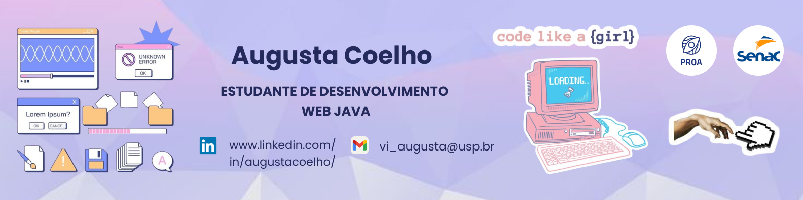
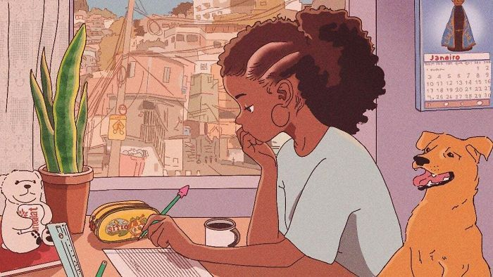

  

#

Olá! Sou Augusta Coelho, estudante de programação, curiosa, apaixonada por resolução de problemas e raciocínio lógico. Atualmente estou iniciando minha trajetória nos estudos de Desenvolvimento Web pelo Instituto PROA. Meu objetivo é conciliar meus conhecimentos técnicos e analíticos na criação de soluções inovadoras e eficientes, além de inspirar através da tecnologia.
  
#

<h3 align="left">Connect with me!</h3>
  
  
  

<h3 align="left">My Stack ~</h3>

  
  
  
  
  
   

#

  <h3>* GitHub Stats *</h3>
   
  

  

#

<picture align="center">
  <source media="(prefers-color-scheme: dark)" srcset="https://raw.githubusercontent.com/AvgvstaDev/AvgvstaDev/output/github-contribution-grid-snake-dark.svg">
  
</picture>

